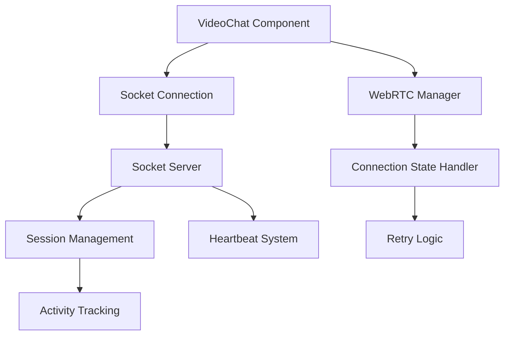

# Design Document: Fix Auto-Disconnect Issue

## Overview

This design addresses the critical auto-disconnect issue where video chat connections terminate after 30-40 seconds despite stable connections. The solution involves refactoring timeout mechanisms, improving heartbeat systems, and enhancing connection state management to ensure connections persist until users explicitly end them.

## Architecture

The fix involves modifications across three main components:

1. **VideoChat Component (Frontend)**: Remove aggressive timeouts, improve connection state handling
2. **Socket Server (Backend)**: Enhance session management and heartbeat processing  
3. **WebRTC Manager**: Better connection lifecycle management and retry logic



## Components and Interfaces

### VideoChat Component Modifications

**Current Issues:**
- `CONNECTION_TIMEOUT_MS = 45000` creates aggressive 45-second timeout
- Multiple overlapping timeout mechanisms
- Reconnection attempts trigger additional timeouts
- Connection state changes immediately trigger failures

**Design Changes:**
- Remove fixed connection timeouts for established connections
- Implement progressive timeout extension during connection setup
- Separate initial connection timeouts from established connection monitoring
- Improve connection state transition handling

### Socket Server Session Management

**Current Issues:**
- 5-minute session cleanup runs regardless of actual activity
- `lastActivity` not properly updated during active chats
- Heartbeat system operates independently of session management

**Design Changes:**
- Implement proper activity tracking during video chats
- Separate connection establishment timeouts from session timeouts
- Enhance heartbeat processing to update activity timestamps
- Add connection quality monitoring

### WebRTC Connection State Handling

**Current Issues:**
- Immediate failure on 'disconnected' state
- Aggressive ICE connection failure handling
- No distinction between temporary and permanent failures

**Design Changes:**
- Implement grace periods for temporary disconnections
- Add connection quality degradation handling
- Improve ICE gathering timeout management
- Better signaling state collision handling

## Data Models

### Enhanced Session Model
```typescript
interface EnhancedSession {
  socketId: string;
  userId: string;
  email: string;
  university: string;
  status: 'connected' | 'searching' | 'matched' | 'in-call';
  partnerId?: string;
  roomId?: string;
  connectedAt: Date;
  lastActivity: Date;
  lastHeartbeat: Date;
  connectionQuality: 'good' | 'fair' | 'poor';
  isInActiveCall: boolean; // New field to track active video chat
}
```

### Connection State Configuration
```typescript
interface ConnectionConfig {
  // Initial connection timeouts (for setup phase)
  initialConnectionTimeout: number; // 60s for initial setup
  iceGatheringTimeout: number; // 15s for ICE gathering
  
  // Established connection monitoring
  heartbeatInterval: number; // 30s heartbeat
  sessionInactivityTimeout: number; // 10 minutes of no heartbeat
  
  // Retry configuration
  maxReconnectAttempts: number; // 5 attempts
  reconnectBaseDelay: number; // 2s base delay
  reconnectMaxDelay: number; // 30s max delay
  
  // Grace periods for temporary issues
  disconnectionGracePeriod: number; // 10s grace for 'disconnected' state
  iceFailureGracePeriod: number; // 5s grace for ICE failures
}
```

## Correctness Properties

*A property is a characteristic or behavior that should hold true across all valid executions of a system-essentially, a formal statement about what the system should do. Properties serve as the bridge between human-readable specifications and machine-verifiable correctness guarantees.*

### Property Reflection

After analyzing all acceptance criteria, I identified several areas where properties can be consolidated:

- Properties 1.1, 1.4, and 1.5 all relate to eliminating time-based disconnections and can be combined into a comprehensive "no arbitrary timeouts" property
- Properties 2.1 and 2.2 both relate to heartbeat functionality and can be combined into a heartbeat round-trip property
- Properties 3.1 and 3.2 both relate to retry behavior and can be combined into a general retry property
- Properties 5.1, 5.2, and 5.3 all relate to connection persistence and can be combined into a comprehensive persistence property

### Converting EARS to Properties

Based on the prework analysis, here are the consolidated correctness properties:

**Property 1: No Arbitrary Timeout Disconnections**
*For any* established WebRTC connection that is actively maintained by heartbeats, the system should not automatically disconnect the connection based solely on elapsed time duration
**Validates: Requirements 1.1, 1.4, 1.5**

**Property 2: Heartbeat Activity Tracking**
*For any* heartbeat signal sent during an active video chat session, the system should update the user's last activity timestamp and maintain the session as active
**Validates: Requirements 2.1, 2.2, 2.3**

**Property 3: Connection State Retry Behavior**
*For any* WebRTC connection that enters a 'disconnected' or 'failed' state, the system should attempt reconnection with appropriate retry logic before terminating the session
**Validates: Requirements 3.1, 3.2, 3.5**

**Property 4: Exponential Backoff Retry Delays**
*For any* sequence of connection retry attempts, the delay between attempts should follow exponential backoff pattern with a reasonable maximum delay
**Validates: Requirements 4.2**

**Property 5: Connection Persistence Through Disruptions**
*For any* temporary network disruption, browser focus change, or quality degradation, the WebRTC connection should persist and recover without terminating the chat session
**Validates: Requirements 5.1, 5.2, 5.3, 5.4, 5.5**

**Property 6: Activity-Based Session Management**
*For any* user session, timeout calculations should be based on actual user inactivity (lack of heartbeats) rather than connection establishment time or duration
**Validates: Requirements 2.3, 2.4, 2.5**

**Property 7: Adaptive Quality Without Disconnection**
*For any* connection quality degradation event, the system should adapt video quality parameters while maintaining the underlying WebRTC connection
**Validates: Requirements 3.3**

**Property 8: Initial Connection Timeout Extension**
*For any* initial WebRTC connection setup that exceeds standard timeouts, the system should extend timeouts or retry connection establishment rather than immediately failing
**Validates: Requirements 1.2, 4.1**

## Error Handling

### Timeout Management
- Remove fixed timeouts for established connections
- Implement progressive timeout extension during initial setup
- Use activity-based timeouts only for truly inactive sessions
- Provide clear user feedback during extended connection attempts

### Connection State Transitions
- Add grace periods for temporary 'disconnected' states
- Implement retry logic for ICE connection failures
- Distinguish between recoverable and permanent connection issues
- Prevent cascading timeout failures during reconnection

### Session Recovery
- Maintain session state during temporary disconnections
- Implement session restoration for reconnected users
- Handle browser tab focus changes gracefully
- Preserve chat context across connection recovery

## Testing Strategy

### Dual Testing Approach
This fix requires both unit tests and property-based tests to ensure comprehensive coverage:

**Unit Tests** will verify:
- Specific timeout value configurations
- Error message content and user feedback
- Integration between components during state transitions
- Edge cases like maximum retry attempts reached

**Property-Based Tests** will verify:
- Universal properties across all connection scenarios
- Timeout behavior across various network conditions
- Heartbeat and activity tracking across different usage patterns
- Connection persistence across various disruption types

### Property-Based Testing Configuration
- Use Jest with fast-check library for property-based testing
- Configure each test to run minimum 100 iterations
- Each property test must reference its design document property
- Tag format: **Feature: fix-auto-disconnect, Property {number}: {property_text}**

### Testing Focus Areas
1. **Connection Lifecycle Testing**: Verify connections persist beyond previous timeout periods
2. **Heartbeat System Testing**: Validate activity tracking and session management
3. **Retry Logic Testing**: Ensure proper exponential backoff and retry behavior
4. **State Transition Testing**: Verify graceful handling of connection state changes
5. **Network Simulation Testing**: Test behavior under various network conditions