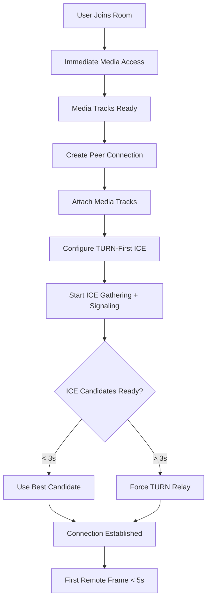

# Design Document: WebRTC Connection Performance Optimization

## Overview

This design implements a comprehensive WebRTC connection performance optimization to reduce connection establishment time from 20-60 seconds to a consistent ~5 seconds across all network types. The solution addresses the core issues of random connection behavior, late TURN fallback, and inefficient execution order through a TURN-first ICE strategy, aggressive timeout control, and deterministic connection patterns.

## Architecture

### Current Architecture Issues

The existing WebRTC implementation suffers from several performance bottlenecks:

1. **Sequential ICE Strategy**: STUN attempts first, TURN only on failure
2. **Long ICE Timeouts**: 60+ second gathering periods
3. **Suboptimal Execution Order**: UI initialization before media readiness
4. **Excessive Network Probing**: Pre-connection tests that add delay
5. **Random Behavior**: Inconsistent connection patterns across attempts

### Optimized Architecture



## Components and Interfaces

### 1. Enhanced ICE Configuration Manager

**Purpose**: Manages optimized ICE server configuration with TURN-first strategy

```typescript
interface OptimizedICEConfig {
  iceServers: RTCIceServer[];
  iceTransportPolicy: 'all' | 'relay';
  iceCandidatePoolSize: number;
  bundlePolicy: 'balanced' | 'max-compat' | 'max-bundle';
}

interface TURNServerConfig {
  urls: string[];
  username: string;
  credential: string;
  priority: number;
  transport: 'udp' | 'tcp';
}

class ICEConfigurationManager {
  // Generate TURN-first configuration
  generateOptimizedConfig(networkType: 'mobile' | 'wifi' | 'unknown'): OptimizedICEConfig;
  
  // Cache successful configurations
  cacheSuccessfulConfig(config: OptimizedICEConfig, networkType: string): void;
  
  // Get cached configuration for faster subsequent connections
  getCachedConfig(networkType: string): OptimizedICEConfig | null;
}
```

### 2. Aggressive Timeout Controller

**Purpose**: Implements strict timeout control with forced TURN fallback

```typescript
interface TimeoutConfig {
  iceGatheringTimeout: number; // 5000ms max
  turnFallbackTimeout: number; // 3000ms
  connectionEstablishmentTimeout: number; // 5000ms
}

class AggressiveTimeoutController {
  private timeouts: Map<string, NodeJS.Timeout> = new Map();
  
  // Set ICE gathering timeout with TURN fallback
  setICEGatheringTimeout(peerConnection: RTCPeerConnection, callback: () => void): void;
  
  // Force TURN relay mode after timeout
  forceTURNRelay(peerConnection: RTCPeerConnection): void;
  
  // Clear all timeouts on successful connection
  clearAllTimeouts(): void;
}
```

### 3. Optimized Connection Sequencer

**Purpose**: Ensures proper execution order for fastest connection establishment

```typescript
interface ConnectionSequence {
  mediaReady: boolean;
  tracksAttached: boolean;
  iceConfigured: boolean;
  signalingReady: boolean;
}

class OptimizedConnectionSequencer {
  private sequence: ConnectionSequence;
  
  // Execute connection steps in optimal order
  async executeOptimizedSequence(
    mediaStream: MediaStream,
    socket: Socket,
    partnerId: string
  ): Promise<RTCPeerConnection>;
  
  // Validate sequence completion before proceeding
  validateSequenceStep(step: keyof ConnectionSequence): boolean;
}
```

### 4. Performance Metrics Collector

**Purpose**: Monitors and reports connection performance metrics

```typescript
interface ConnectionMetrics {
  startTime: number;
  mediaReadyTime: number;
  iceGatheringStartTime: number;
  firstCandidateTime: number;
  connectionEstablishedTime: number;
  firstRemoteFrameTime: number;
  totalConnectionTime: number;
  candidateTypes: string[];
  networkType: string;
  success: boolean;
}

class PerformanceMetricsCollector {
  private metrics: ConnectionMetrics;
  
  // Start timing connection attempt
  startConnectionTiming(): void;
  
  // Record milestone timestamps
  recordMilestone(milestone: keyof ConnectionMetrics): void;
  
  // Calculate and report final metrics
  reportConnectionMetrics(): ConnectionMetrics;
}
```

## Data Models

### ICE Server Configuration

```typescript
interface OptimizedICEServers {
  primary: {
    stun: string[];
    turn: TURNServerConfig[];
  };
  fallback: {
    turn: TURNServerConfig[];
  };
}

interface CachedICEConfig {
  config: OptimizedICEConfig;
  networkType: string;
  timestamp: number;
  successRate: number;
}
```

### Connection State Management

```typescript
interface OptimizedConnectionState {
  phase: 'media-access' | 'peer-setup' | 'ice-gathering' | 'signaling' | 'connected';
  startTime: number;
  currentTimeout: NodeJS.Timeout | null;
  candidatesGathered: RTCIceCandidate[];
  turnForced: boolean;
  networkType: 'mobile' | 'wifi' | 'unknown';
}
```

## Correctness Properties

*A property is a characteristic or behavior that should hold true across all valid executions of a system-essentially, a formal statement about what the system should do. Properties serve as the bridge between human-readable specifications and machine-verifiable correctness guarantees.*

### Property 1: Connection Time Consistency
*For any* network environment and user pair, connection establishment time should be less than 5 seconds in 90% of attempts
**Validates: Requirements 6.1, 6.2, 6.3, 6.4, 6.5**

### Property 2: TURN-First Strategy Enforcement  
*For any* ICE configuration generation, TURN servers should be included and prioritized alongside STUN servers, never as fallback-only
**Validates: Requirements 1.1, 1.2, 1.3, 1.5**

### Property 3: Media Track Attachment Order
*For any* peer connection creation, media tracks should be attached before createOffer() is called to avoid renegotiation
**Validates: Requirements 3.1, 3.2, 3.3, 3.5**

### Property 4: ICE Timeout Enforcement
*For any* ICE gathering process, if no viable candidates are found within 3 seconds, TURN relay mode should be forced immediately
**Validates: Requirements 2.2, 2.3, 2.5**

### Property 5: Network Probing Elimination
*For any* connection attempt, no NAT type detection, bandwidth tests, or pre-connection quality checks should delay connection establishment
**Validates: Requirements 4.1, 4.2, 4.3, 4.4, 4.5**

### Property 6: Deterministic Behavior Consistency
*For any* repeated connection attempts under similar network conditions, the connection process should follow the same deterministic steps and timing
**Validates: Requirements 7.2, 7.3, 7.4, 9.3**

### Property 7: Parallel Execution Independence
*For any* ICE gathering and signaling operations, they should execute concurrently without blocking each other
**Validates: Requirements 5.1, 5.3, 5.4, 5.5**

### Property 8: Configuration Caching Effectiveness
*For any* successful connection, the ICE configuration should be cached and reused for subsequent connections in the same session
**Validates: Requirements 8.4, 8.5**

## Error Handling

### ICE Gathering Failures

1. **Timeout Handling**: Force TURN relay after 3 seconds
2. **No Candidates**: Retry with relay-only configuration
3. **TURN Server Failures**: Fallback to alternative TURN servers
4. **Network Changes**: Detect and adapt to network transitions

### Connection Establishment Failures

1. **Signaling Errors**: Retry with exponential backoff (max 2 attempts)
2. **Media Track Errors**: Graceful degradation with audio-only fallback
3. **Peer Connection Failures**: Clean recreation with optimized configuration
4. **Performance Degradation**: Automatic fallback to more aggressive TURN usage

### Performance Monitoring

1. **Slow Connections**: Log detailed timing for connections > 5 seconds
2. **Random Failures**: Track and analyze failure patterns
3. **Network-Specific Issues**: Collect metrics per network type
4. **Configuration Effectiveness**: Monitor cached config success rates

## Testing Strategy

### Unit Testing Approach

**Focus Areas**:
- ICE configuration generation with TURN-first strategy
- Timeout controller behavior under various scenarios
- Connection sequencer execution order validation
- Performance metrics collection accuracy

**Key Test Cases**:
- TURN server prioritization in ICE configuration
- Forced relay activation after timeout
- Media track attachment before offer creation
- Metrics collection for successful and failed connections

### Property-Based Testing Configuration

**Testing Framework**: Use fast-check for JavaScript property-based testing
**Test Configuration**: Minimum 100 iterations per property test
**Property Test Tags**: Each test references its design document property

**Property Test Examples**:

```typescript
// Property 1: Connection Time Consistency
test('Connection establishment time under 5 seconds', async () => {
  await fc.assert(fc.asyncProperty(
    fc.record({
      networkType: fc.constantFrom('mobile', 'wifi', 'unknown'),
      turnServers: fc.array(fc.string(), { minLength: 1, maxLength: 3 }),
      stunServers: fc.array(fc.string(), { minLength: 1, maxLength: 2 })
    }),
    async (config) => {
      const startTime = performance.now();
      const connection = await establishConnection(config);
      const duration = performance.now() - startTime;
      
      expect(duration).toBeLessThan(5000);
      expect(connection.connectionState).toBe('connected');
    }
  ), { numRuns: 100 });
});

// Property 2: TURN-First Strategy Enforcement
test('TURN servers included in all ICE configurations', () => {
  fc.assert(fc.property(
    fc.constantFrom('mobile', 'wifi', 'unknown'),
    (networkType) => {
      const config = generateOptimizedICEConfig(networkType);
      const turnServers = config.iceServers.filter(server => 
        server.urls.some(url => url.startsWith('turn:'))
      );
      
      expect(turnServers.length).toBeGreaterThan(0);
      expect(config.iceTransportPolicy).toBeDefined();
    }
  ), { numRuns: 100 });
});
```

### Integration Testing

**Test Scenarios**:
1. **Mobile Network Simulation**: Test with CGNAT and symmetric NAT
2. **College Wi-Fi Simulation**: Test with restrictive firewall rules  
3. **Network Transition**: Test connection during network changes
4. **Concurrent Connections**: Test multiple simultaneous connection attempts
5. **Performance Regression**: Validate consistent sub-5-second connections

**Performance Benchmarks**:
- 90% of connections under 5 seconds
- 99% of connections under 8 seconds  
- Zero random failures in controlled environment
- Consistent behavior across 100+ connection attempts

### Cross-Browser Compatibility

**Target Browsers**:
- Chrome/Chromium (desktop and mobile)
- Firefox (desktop and mobile)
- Safari (desktop and mobile)
- Edge (desktop)

**Mobile-Specific Testing**:
- 4G/5G network conditions
- Battery optimization impact
- Background/foreground transitions
- Network quality variations

## Implementation Notes

### Critical Implementation Details

1. **TURN Server Configuration**: Ensure both UDP and TCP TURN servers are available
2. **ICE Candidate Pool**: Limit to 4-6 candidates to reduce gathering time
3. **Bundle Policy**: Use 'max-bundle' for faster negotiation
4. **Media Constraints**: Optimize video resolution for faster encoding
5. **Signaling Optimization**: Minimize SDP payload size

### Performance Optimizations

1. **Configuration Caching**: Cache successful ICE configs per session
2. **Credential Reuse**: Reuse TURN credentials across connections
3. **Candidate Prioritization**: Prefer relay candidates on mobile networks
4. **Early Media**: Start media flow before full ICE completion
5. **Parallel Processing**: Overlap ICE gathering with signaling

### Monitoring and Debugging

1. **Connection Timing Logs**: Detailed timestamps for each phase
2. **ICE Candidate Analysis**: Track candidate types and success rates
3. **Network Type Detection**: Classify and adapt to network conditions
4. **Performance Alerts**: Warn when connections exceed 5-second target
5. **Failure Analysis**: Detailed logging for connection failures

This design provides a comprehensive approach to achieving consistent, fast WebRTC connections while maintaining reliability across all network types.