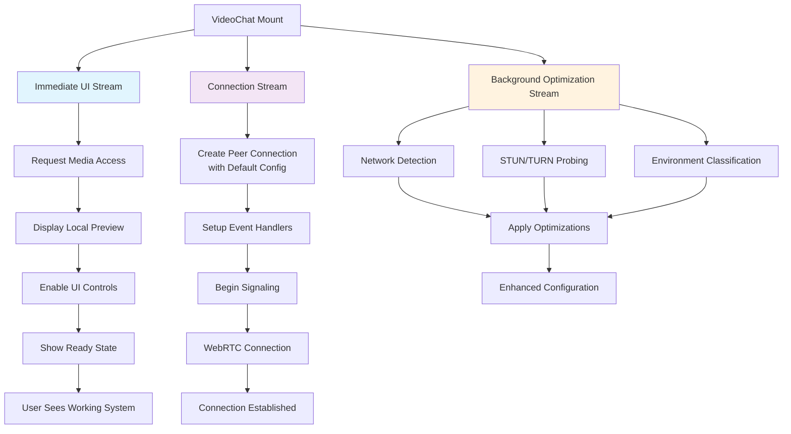

# Design Document: WebRTC UX Optimization

## Overview

This design optimizes the WebRTC connection user experience by restructuring the initialization sequence to prioritize time-to-first-frame and decouple UI readiness from network validation. The core principle is **immediate visual feedback**: users should see their camera preview and responsive controls within 500ms of joining a room, while network optimization happens transparently in the background.

The current implementation blocks UI updates with sequential network detection, STUN/TURN probing, and artificial delays that accumulate to create a sluggish user experience. This design eliminates blocking operations and reorders execution to prioritize user-visible progress.

## Architecture

The optimization implements a **Parallel Execution Model** with three concurrent streams:

1. **Immediate UI Stream**: Media access → Local preview → UI controls (target: <500ms)
2. **Connection Stream**: Peer connection creation → Signaling → WebRTC establishment
3. **Background Optimization Stream**: Network detection → Configuration enhancement → Quality adaptation



## Components and Interfaces

### Immediate UI Stream Implementation

**Fast Media Access**:
```typescript
const initializeImmediateUI = async () => {
  try {
    // Start media access immediately - no waiting
    console.log('🎥 IMMEDIATE: Requesting camera access');
    const stream = await getMediaStreamWithFallback();
    
    // Attach to video element immediately
    if (localVideoRef.current) {
      localVideoRef.current.srcObject = stream;
      console.log('✅ IMMEDIATE: Local preview displayed');
    }
    
    // Enable UI controls immediately
    setUIReady(true);
    setLocalStreamReady(true);
    
    return stream;
  } catch (error) {
    // Show error immediately, don't wait for network detection
    setMediaError(error.message);
    throw error;
  }
};
```

**Non-Blocking UI State Management**:
```typescript
interface OptimizedUIState {
  mediaReady: boolean;        // Local camera preview visible
  uiReady: boolean;          // Controls responsive and interactive
  connectionReady: boolean;   // WebRTC peer connection established
  networkOptimized: boolean; // Background optimization complete
}

// UI shows ready when media is available, regardless of network state
const isUserInterfaceReady = () => mediaReady && uiReady;
const isConnectionReady = () => connectionReady;
const isFullyOptimized = () => networkOptimized;
```

### Parallel Connection Stream

**Default Configuration Peer Connection**:
```typescript
const initializeConnectionStream = async (localStream: MediaStream) => {
  // Use default WebRTC config immediately - don't wait for network detection
  const defaultConfig = getDefaultWebRTCConfiguration();
  
  console.log('🔗 CONNECTION: Creating peer connection with default config');
  const peerConnection = new RTCPeerConnection(defaultConfig);
  
  // Add tracks immediately
  localStream.getTracks().forEach(track => {
    peerConnection.addTrack(track, localStream);
  });
  
  // Setup event handlers
  setupPeerConnectionEventHandlers(peerConnection);
  
  // Begin signaling immediately if initiator
  if (shouldInitiate) {
    // No artificial 3-second delay
    createOffer();
  }
  
  return peerConnection;
};
```

**Eliminated Artificial Delays**:
```typescript
// BEFORE (current implementation):
const offerTimeout = setTimeout(() => {
  createOffer();
}, 3000); // Artificial 3-second delay

const fallbackTimeout = setTimeout(() => {
  createOffer();
}, 15000); // Artificial 15-second fallback

// AFTER (optimized implementation):
const createOfferImmediately = () => {
  if (shouldInitiate && peerConnection.signalingState === 'stable') {
    createOffer(); // No delay
  }
};
```

### Background Optimization Stream

**Non-Blocking Network Detection**:
```typescript
const initializeBackgroundOptimization = async () => {
  // Start network detection without blocking UI or connection
  console.log('🔍 BACKGROUND: Starting network optimization');
  
  const networkDetectionPromise = testWebRTCConnectivity();
  const stunTurnProbePromise = probeSTUNTURNServers();
  
  // Don't await - let these run in background
  Promise.all([networkDetectionPromise, stunTurnProbePromise])
    .then(([connectivity, serverResults]) => {
      console.log('🔍 BACKGROUND: Network optimization complete');
      applyNetworkOptimizations(connectivity, serverResults);
    })
    .catch(error => {
      console.warn('🔍 BACKGROUND: Network optimization failed, using defaults:', error);
    });
  
  // Return immediately - don't block
  return Promise.resolve();
};
```

**Progressive Configuration Enhancement**:
```typescript
const applyNetworkOptimizations = (connectivity: ConnectivityResult, serverResults: ServerProbeResult) => {
  if (!peerConnectionRef.current) return;
  
  // Only apply optimizations if connection is not yet established
  if (peerConnectionRef.current.connectionState === 'connected') {
    console.log('🔍 BACKGROUND: Connection already established, storing optimizations for next time');
    storeOptimizationsForFutureUse(connectivity, serverResults);
    return;
  }
  
  // Apply optimizations to current connection
  const optimizedConfig = buildOptimizedConfiguration(connectivity, serverResults);
  
  // Update ICE servers if gathering hasn't completed
  if (peerConnectionRef.current.iceGatheringState !== 'complete') {
    updateICEConfiguration(optimizedConfig);
  }
  
  console.log('✅ BACKGROUND: Network optimizations applied');
};
```

## Data Models

### Optimized Initialization State
```typescript
interface OptimizedInitializationState {
  // Immediate UI Stream
  mediaStream: MediaStream | null;
  localPreviewReady: boolean;
  uiControlsEnabled: boolean;
  mediaError: string | null;
  
  // Connection Stream  
  peerConnection: RTCPeerConnection | null;
  signalingReady: boolean;
  connectionEstablished: boolean;
  
  // Background Optimization Stream
  networkDetectionComplete: boolean;
  networkOptimizationsApplied: boolean;
  enhancedConfigurationAvailable: boolean;
  
  // Timing Metrics
  timeToFirstFrame: number;
  timeToUIReady: number;
  timeToConnectionReady: number;
  timeToFullyOptimized: number;
}
```

### Parallel Execution Configuration
```typescript
interface ParallelExecutionConfig {
  // UI Stream Settings
  mediaAccessTimeout: number;        // 5000ms - fail fast if no camera
  uiReadyThreshold: number;         // 500ms - target for local preview
  
  // Connection Stream Settings
  useDefaultConfig: boolean;        // true - don't wait for network detection
  eliminateArtificialDelays: boolean; // true - remove 3s and 15s delays
  
  // Background Stream Settings
  networkDetectionTimeout: number;   // 2000ms - fallback to defaults
  applyOptimizationsAsync: boolean; // true - don't block connection
  
  // Performance Targets
  targetTimeToFirstFrame: number;   // 500ms
  targetTimeToConnection: number;   // 3000ms (down from 10-15s current)
}
```

### Network Optimization Results
```typescript
interface NetworkOptimizationResult {
  detectionComplete: boolean;
  networkType: 'open' | 'moderate' | 'restrictive';
  recommendedConfig: RTCConfiguration;
  stunServerLatency: number[];
  turnServerAvailability: boolean[];
  optimizationApplied: boolean;
  fallbackToDefaults: boolean;
}
```

## Correctness Properties

*A property is a characteristic or behavior that should hold true across all valid executions of a system-essentially, a formal statement about what the system should do. Properties serve as the bridge between human-readable specifications and machine-verifiable correctness guarantees.*

Let me analyze the acceptance criteria for testability:

<function_calls>
<invoke name="prework">
<parameter name="featureName">webrtc-ux-optimization

### Converting EARS to Properties

Based on the prework analysis, here are the consolidated correctness properties after eliminating redundancy:

**Property 1: Media Access Priority**
*For any* VideoChat initialization, camera access should be requested before any network detection operations begin
**Validates: Requirements 1.1, 5.1**

**Property 2: Time to First Frame Performance**
*For any* successful camera access grant, the local video preview should be displayed within 500ms
**Validates: Requirements 1.2**

**Property 3: UI Independence from Network Operations**
*For any* network detection or STUN/TURN validation operation, local camera preview and UI controls should remain functional and not be blocked
**Validates: Requirements 1.4, 1.5, 2.2, 2.3, 6.1**

**Property 4: Immediate UI Responsiveness**
*For any* VideoChat component initialization, UI elements should be rendered and responsive immediately without waiting for network operations
**Validates: Requirements 2.1, 7.4**

**Property 5: Parallel Execution Independence**
*For any* VideoChat initialization, media stream acquisition and network detection should start concurrently and UI setup should proceed regardless of network detection status
**Validates: Requirements 3.1, 3.2**

**Property 6: Default Configuration Fallback**
*For any* peer connection creation, the system should use immediately available default configuration and not wait for network detection completion
**Validates: Requirements 3.4, 3.5, 6.4, 8.3**

**Property 7: Elimination of Artificial Delays**
*For any* offer creation or connection establishment, the system should proceed immediately when conditions are met without artificial 3-second or 15-second delays
**Validates: Requirements 4.1, 4.2, 4.3, 4.4**

**Property 8: Asynchronous Network Optimization**
*For any* completed network detection, results should be applied to configuration without affecting UI operations or blocking user interaction
**Validates: Requirements 3.3, 6.2, 6.5, 8.4**

**Property 9: Execution Order Enforcement**
*For any* VideoChat initialization, the execution order should be: media access, UI setup, peer connection creation, with network detection running in parallel
**Validates: Requirements 5.3, 7.1, 7.2**

**Property 10: Non-Blocking Async Operations**
*For any* network connectivity tests or STUN/TURN server validation during initialization, these operations should not use blocking await patterns that delay UI or connection streams
**Validates: Requirements 8.1, 8.2**

## Error Handling

### Media Access Failures
- If camera/microphone access fails, show error immediately without attempting network detection
- Provide clear user guidance for permission issues and hardware problems
- Don't block UI rendering even when media access fails
- Allow users to retry media access without full component reinitialization

### Network Detection Failures
- If background network detection fails, continue with default WebRTC configuration
- Log network detection failures for debugging but don't show user errors
- Store partial network results for future optimization attempts
- Implement progressive enhancement - apply optimizations as they become available

### Connection Stream Failures
- If peer connection creation fails with default config, retry with minimal config
- If signaling fails, provide immediate user feedback and retry options
- Don't fall back to network detection delays when connection attempts fail
- Maintain UI responsiveness even during connection failures

### Performance Degradation Handling
- If time-to-first-frame exceeds 500ms, log performance warning
- If UI becomes unresponsive during initialization, implement emergency fallback
- Monitor and alert on execution order violations
- Provide performance metrics for optimization monitoring

## Testing Strategy

### Dual Testing Approach
This optimization requires both unit tests and property-based tests to ensure the parallel execution model works correctly:

**Unit Tests** will verify:
- Specific timing requirements (500ms time-to-first-frame)
- Error handling for media access and network detection failures
- Integration between parallel streams and state management
- Edge cases like rapid component mounting/unmounting

**Property-Based Tests** will verify:
- Universal properties across all initialization scenarios and timing variations
- Execution order behavior across various network conditions and media access patterns
- Independence between UI, connection, and optimization streams
- Performance characteristics across different system loads and network conditions

### Property-Based Testing Configuration
- Use Jest with fast-check library for property-based testing
- Configure each test to run minimum 100 iterations due to timing-sensitive nature
- Each property test must reference its design document property
- Tag format: **Feature: webrtc-ux-optimization, Property {number}: {property_text}**

### Testing Focus Areas
1. **Parallel Execution Testing**: Verify concurrent stream execution and independence
2. **Performance Testing**: Validate time-to-first-frame and responsiveness requirements
3. **Order Enforcement Testing**: Ensure correct execution sequence within each stream
4. **Fallback Behavior Testing**: Test default configuration usage and error handling
5. **Async Operation Testing**: Verify non-blocking network detection and optimization
6. **UI Responsiveness Testing**: Test immediate UI availability and interaction capability
7. **Integration Testing**: Test coordination between parallel streams and final system state