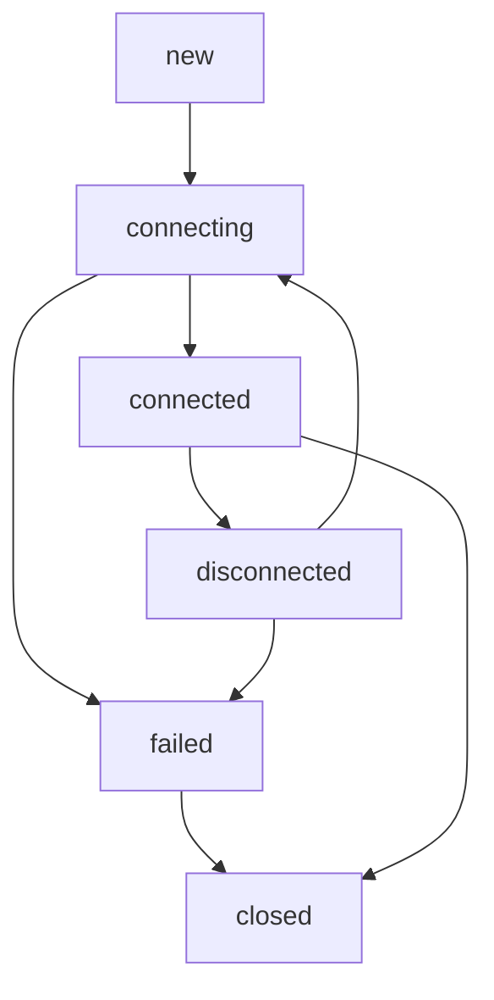

# Student Video Chat Platform - Developer System Architecture

**Version:** 1.0  
**Last Updated:** January 2025  
**Target Audience:** Developers, System Architects, DevOps Engineers

---

## Table of Contents

1. [System Overview](#1-system-overview)
2. [Authentication & Session Context](#2-authentication--session-context)
3. [Matchmaking Flow (Step-by-Step)](#3-matchmaking-flow-step-by-step)
4. [Transition from Match → Call Page](#4-transition-from-match--call-page)
5. [WebRTC Initialization Lifecycle](#5-webrtc-initialization-lifecycle)
6. [Signaling Flow (Offer / Answer / ICE)](#6-signaling-flow-offer--answer--ice)
7. [ICE Candidate Analysis](#7-ice-candidate-analysis)
8. [Connection State Machine](#8-connection-state-machine)
9. [Media Stability & NAT Behavior](#9-media-stability--nat-behavior)
10. [Reconnection Logic (Current Behavior)](#10-reconnection-logic-current-behavior)
11. [Call Termination & Cleanup](#11-call-termination--cleanup)
12. [Common Failure Scenarios](#12-common-failure-scenarios)
13. [Key Variables & Their Responsibilities](#13-key-variables--their-responsibilities)
14. [End-to-End Sequence Summary](#14-end-to-end-sequence-summary)
15. [Current Bugs & Issues](#15-current-bugs--issues)
16. [Potential Improvements](#16-potential-improvements)

---

## 1. System Overview

### High-Level Architecture

The student video chat platform consists of four main components:

1. **Next.js Frontend** (`app/`) - React-based client application
2. **Socket.io Signaling Server** (`socket-server/`) - WebRTC signaling and matchmaking
3. **WebRTC P2P Connection** - Direct peer-to-peer media streaming
4. **MongoDB Database** - User authentication and session persistence

### Component Interactions

```
┌─────────────────┐    ┌─────────────────┐    ┌─────────────────┐
│   Next.js App   │◄──►│  Socket Server  │◄──►│    MongoDB      │
│  (Frontend)     │    │  (Signaling)    │    │   (Database)    │
└─────────────────┘    └─────────────────┘    └─────────────────┘
         │                       │
         │                       │
         ▼                       ▼
┌─────────────────┐    ┌─────────────────┐
│   WebRTC P2P    │◄──►│   TURN/STUN     │
│  (Media Stream) │    │   (NAT Bypass)  │
└─────────────────┘    └─────────────────┘
```

### Why Matchmaking + WebRTC Are Tightly Coupled

The system architecture tightly couples matchmaking with WebRTC because:

1. **Session State Synchronization**: Both users must be ready simultaneously for WebRTC negotiation
2. **Signaling Channel Dependency**: Socket.io serves dual purpose as matchmaker and WebRTC signaling
3. **Race Condition Prevention**: Deterministic initiator selection prevents duplicate offers
4. **Resource Management**: Failed WebRTC connections trigger re-matching automatically

### Data Flow Between Components

1. **Authentication Flow**: JWT tokens → MongoDB validation → Socket.io connection
2. **Matching Flow**: User pool management → Partner selection → Room creation
3. **Signaling Flow**: WebRTC offers/answers/ICE candidates via Socket.io
4. **Media Flow**: Direct P2P connection bypassing server after establishment
---


## 2. Authentication & Session Context

### User Identity Establishment

**JWT Token Structure:**
```javascript
// Token payload (base64 decoded)
{
  userId: "user_12345",
  email: "student@university.edu", 
  university: "University Name",
  iat: 1640995200,
  exp: 1641081600
}
```

**Authentication Flow:**
1. User logs in → JWT token generated and stored in `localStorage`
2. Socket.io connection uses token in `auth.token` handshake
3. Server validates JWT and extracts `userId`, `email`, `university`
4. Session created in `activeSessions` Map with socket ID

### Session State Storage

**Client-Side Storage:**
- `localStorage.authToken` - JWT authentication token
- `sessionStorage.videoChat_sessionState` - Temporary session restoration data

**Server-Side Storage:**
```javascript
// activeSessions Map structure
activeSessions.set(userId, {
  socketId: "socket_abc123",
  userId: "user_12345", 
  email: "student@university.edu",
  university: "University Name",
  status: "connected" | "searching" | "matched" | "in-call",
  partnerId: null | "partner_user_id",
  roomId: null | "room_xyz789",
  connectedAt: Date,
  lastActivity: Date,
  lastHeartbeat: Date,
  isInActiveCall: boolean,
  connectionQuality: "good" | "fair" | "poor",
  isVisible: boolean,  // Tab visibility
  isOnline: boolean    // Network status
});
```

### Session Continuity Impact

Session continuity affects both matching and calls:

- **Matching**: Users can rejoin matching pool after disconnection
- **Calls**: Active video sessions can be restored after network interruption
- **Cleanup**: Inactive sessions are cleaned up every 2 minutes
- **Timeouts**: Different timeouts for active calls (30min) vs idle sessions (10min)

---

## 3. Matchmaking Flow (Step-by-Step)

### User Pool Entry Process

**Step 1: User Clicks "Start Matching"**
```javascript
// Client: app/page.tsx
handleStartMatching() {
  socket.emit('join-matching-pool');
  setMatchingStatus('searching');
}
```

**Step 2: Server Adds to Pool**
```javascript
// Server: socket-server/server.js
socket.on('join-matching-pool', () => {
  matchingPool.add(socket.userId);
  session.status = 'searching';
  findMatch(socket.userId);
});
```

### Matching Rules & Algorithm

**University Restriction:**
- Only users from same university can be matched
- Enforced in `findMatch()` function: `potentialMatch.university === currentUser.university`

**Self-Matching Prevention:**
- Explicit check: `potentialMatchId !== userId`
- User removed from pool before partner search

**Random Selection Algorithm:**
```javascript
// lib/matching-service.js
findMatch(userId) {
  const availableUsers = Array.from(this.matchingPool)
    .filter(id => id !== userId);
  
  if (availableUsers.length === 0) return null;
  
  const randomIndex = Math.floor(Math.random() * availableUsers.length);
  return availableUsers[randomIndex];
}
```

### Race Condition Prevention

**Atomic Pool Operations:**
1. Remove requesting user from pool first
2. Find available partners (excluding requester)
3. Remove selected partner from pool
4. Create match or re-add user if no partners

**Concurrent Access Handling:**
- JavaScript single-threaded nature prevents race conditions
- Pool operations are atomic within event loop

### Room ID & Role Assignment

**Room ID Generation:**
```javascript
function generateRoomId() {
  return 'room_' + Math.random().toString(36).substr(2, 9);
}
```

**Initiator Role Determination:**
```javascript
// Deterministic comparison prevents duplicate offers
const shouldInitiate = currentUserId.localeCompare(partnerId) < 0;
setIsInitiator(shouldInitiate);
```

**Key Variables Set:**
- `partnerId`: Matched user's ID
- `roomId`: Unique room identifier  
- `shouldInitiate`: Boolean determining who creates WebRTC offer---

#
# 4. Transition from Match → Call Page

### Match Data Transmission

**Server Match Notification:**
```javascript
// Both users receive this event
socket.emit('match-found', {
  partnerId: userId2,  // or userId1 for the other user
  roomId: roomId
});
```

**Client Navigation:**
```javascript
// app/page.tsx
newSocket.on('match-found', (matchData) => {
  const chatUrl = `/chat?partnerId=${matchData.partnerId}&roomId=${matchData.roomId}`;
  router.push(chatUrl);
});
```

### URL Parameters & State Passing

**Chat Page URL Structure:**
```
/chat?partnerId=user_12345&roomId=room_abc789&restored=true
```

**Parameter Extraction:**
```javascript
// app/chat/page.tsx
const searchParams = useSearchParams();
const partnerId = searchParams.get('partnerId');
const roomId = searchParams.get('roomId'); 
const isSessionRestored = searchParams.get('restored') === 'true';
```

### Duplicate Connection Prevention

**Client-Side Prevention:**
- Navigation replaces current page (no back button to matching)
- Socket connection reused, not recreated

**Server-Side Prevention:**
- Session status updated to 'matched' prevents re-matching
- Existing partner relationship checked before new matches

### Signaling Activation Point

**Signaling becomes active when:**
1. VideoChat component mounts
2. Socket event listeners are registered
3. WebRTC initialization begins
4. Media access is granted

**Critical Timing:**
- Socket events must be registered before WebRTC offer creation
- 3-second delay ensures both sides are ready for signaling

---

## 5. WebRTC Initialization Lifecycle

### Media Acquisition (getUserMedia)

**Fallback Strategy Sequence:**
1. **High Quality**: 1280x720@30fps + enhanced audio
2. **Medium Quality**: 640x480@24fps + standard audio  
3. **Low Quality**: 320x240@15fps + basic audio
4. **Minimal**: Basic video + audio constraints
5. **Simple**: `{video: true, audio: true}`
6. **Audio Only**: `{video: false, audio: true}`

**Implementation:**
```javascript
// app/lib/webrtc-config.ts
export async function getMediaStreamWithFallback(): Promise<MediaStream> {
  const configurations = [
    MediaConstraints.high,
    MediaConstraints.medium, 
    MediaConstraints.low,
    // ... more fallbacks
  ];
  
  for (let config of configurations) {
    try {
      const stream = await navigator.mediaDevices.getUserMedia(config);
      return stream;
    } catch (error) {
      // Try next configuration
    }
  }
}
```

### Track Handling & Management

**Track Addition to PeerConnection:**
```javascript
stream.getTracks().forEach((track, index) => {
  console.log(`Adding track ${index + 1}: ${track.kind} (${track.label})`);
  peerConnection.addTrack(track, stream);
});
```

**Track State Monitoring:**
- `track.readyState`: 'live' | 'ended'
- `track.enabled`: Controls mute/unmute
- `track.stop()`: Permanently ends track

### PeerConnection Creation & Configuration

**Network-Aware Configuration:**
```javascript
// app/lib/webrtc-network-traversal.ts
export async function getNetworkTraversalConfig(forceRelay: boolean = false): Promise<WebRTCConfig> {
  const networkEnv = await detectNetworkEnvironment();
  
  // Build ICE servers based on network type
  const iceServers = [];
  
  // Add STUN servers (unless forcing relay)
  if (!forceRelay) {
    iceServers.push(...STUN_SERVERS.map(url => ({ urls: url })));
  }
  
  // Add TURN servers for NAT traversal
  const turnServers = process.env.NODE_ENV === 'production' 
    ? PRODUCTION_TURN_SERVERS 
    : [...PRODUCTION_TURN_SERVERS, ...FREE_TURN_SERVERS];
    
  // Configure ICE transport policy
  let iceTransportPolicy = forceRelay ? 'relay' : 'all';
  
  return {
    iceServers,
    iceTransportPolicy,
    iceCandidatePoolSize: forceRelay ? 0 : 10,
    bundlePolicy: 'max-bundle',
    rtcpMuxPolicy: 'require'
  };
}
```

### ICE Server Configuration Details

**STUN Servers (NAT Discovery):**
```javascript
const STUN_SERVERS = [
  'stun:stun.l.google.com:19302',
  'stun:stun1.l.google.com:19302',
  'stun:stun.services.mozilla.com',
  'stun:stun.stunprotocol.org:3478'
];
```

**TURN Servers (Relay for Restrictive Networks):**
```javascript
const PRODUCTION_TURN_SERVERS = [
  {
    urls: ['turn:a.relay.metered.ca:80', 't(>1000ms)ncy  lateetwork
4. High n detectedtivityconnec STUN 
3. Noiledfaon attempts cti conneous'
2. Previictiverestrted as 'etectwork type d**
1. Nee is Forced:y Mod Rela
**When
works)e netr restrictivorced fo(frs y TURN serve'`: Use onl`'relays)
- tworkn neopedefault for N and TURN (both STUUse 
- `'all'`: **ion Logic:cy Select

**Polieagcy Usolisport Pran
### ICE T
];
```
L
  }_CREDENTIAED_TURNETERLIC_Mv.NEXT_PUBs.ential: procesreden  c
  NAME,TURN_USERTERED_PUBLIC_ME.env.NEXT_essname: proc
    user],a:443'metered.clay.reurns:a.---

##
 6. Signaling Flow (Offer / Answer / ICE)

### Exact Order of WebRTC Negotiation

**Phase 1: Offer Creation (Initiator)**
```javascript
// 1. Create offer
const offer = await peerConnection.createOffer({
  offerToReceiveAudio: true,
  offerToReceiveVideo: true,
  iceRestart: false
});

// 2. Set local description  
await peerConnection.setLocalDescription(offer);

// 3. Send via socket
socket.emit('offer', offer);
```

**Phase 2: Answer Creation (Receiver)**
```javascript
// 1. Receive offer
socket.on('offer', async (offer) => {
  // 2. Set remote description
  await peerConnection.setRemoteDescription(offer);
  
  // 3. Create answer
  const answer = await peerConnection.createAnswer();
  
  // 4. Set local description
  await peerConnection.setLocalDescription(answer);
  
  // 5. Send answer
  socket.emit('answer', answer);
});
```

**Phase 3: Answer Processing (Initiator)**
```javascript
socket.on('answer', async (answer) => {
  await peerConnection.setRemoteDescription(answer);
});
```

**Phase 4: ICE Candidate Exchange (Both)**
```javascript
peerConnection.onicecandidate = (event) => {
  if (event.candidate) {
    socket.emit('ice-candidate', event.candidate.toJSON());
  }
};

socket.on('ice-candidate', async (candidate) => {
  await peerConnection.addIceCandidate(new RTCIceCandidate(candidate));
});
```

### Socket Events & Timing Dependencies

**Critical Socket Events:**
- `offer`: WebRTC session description (SDP) from initiator
- `answer`: WebRTC session description (SDP) from receiver  
- `ice-candidate`: Network connectivity candidates

**Timing Dependencies:**
1. Both sides must register socket listeners before offer creation
2. Local description must be set before sending offer/answer
3. Remote description must be set before creating answer
4. ICE candidates can arrive before or after answer exchange

### Duplicate Offer Prevention

**Offer Collision Handling:**
```javascript
if (peerConnection.signalingState === 'have-local-offer') {
  // Handle collision - lower user ID backs off
  if (currentUserId.localeCompare(partnerId) < 0) {
    // Rollback our offer and accept theirs
    await peerConnection.setLocalDescription({ type: 'rollback' });
    await peerConnection.setRemoteDescription(offer);
  } else {
    // Ignore their offer, keep ours
    return;
  }
}
```

**Prevention Mechanisms:**
1. Deterministic initiator selection based on user ID comparison
2. 3-second delay before offer creation
3. Signaling state validation before offer creation
4. Rollback mechanism for collision resolution

---

## 7. ICE Candidate Analysis

### ICE Candidate Types Explained

**Host Candidates:**
- **Source**: Local network interfaces
- **Example**: `192.168.1.100:54321`
- **Usage**: Direct connection within same network
- **Limitation**: Blocked by NAT/firewall

**Server Reflexive (srflx) Candidates:**
- **Source**: STUN server responses
- **Example**: `203.0.113.45:12345` (public IP:port)
- **Usage**: Connection through NAT
- **Requirement**: STUN server accessibility

**Relay Candidates:**
- **Source**: TURN server allocation
- **Example**: `turn-server.com:3478` (relayed through TURN)
- **Usage**: Connection through restrictive firewalls
- **Requirement**: TURN server with authentication

### Why TURN is Critical for College/Hostel WiFi

**Network Restrictions in Educational Institutions:**
1. **Symmetric NAT**: Blocks direct P2P connections
2. **Firewall Rules**: Restricts outbound UDP traffic
3. **Port Blocking**: Limits available port ranges
4. **Deep Packet Inspection**: May interfere with WebRTC

**TURN Server Benefits:**
- Provides guaranteed connectivity path
- Uses standard ports (80, 443, 3478)
- Supports TCP transport for firewall bypass
- Maintains connection through NAT timeouts

### Root Cause of "0 Relay Candidates" Issue

**Common Causes:**
1. **Missing TURN Configuration**: No TURN servers configured
2. **Invalid Credentials**: Username/password authentication failure
3. **Network Blocking**: TURN server ports blocked by firewall
4. **Server Unavailability**: TURN service down or overloaded

**Detection in Code:**
```javascript
peerConnection.onicecandidate = (event) => {
  if (event.candidate?.type === 'relay') {
    relayCandidateCount++;
  } else if (!event.candidate) {
    // ICE gathering complete
    if (relayCandidateCount === 0 && networkType === 'restrictive') {
      console.error('❌ CRITICAL: No TURN relay candidates found!');
    }
  }
};
```

**Impact on Connection Success:**
- **Open Networks**: May work with host/srflx candidates
- **Moderate NAT**: Requires srflx candidates (STUN)
- **Restrictive Networks**: Requires relay candidates (TURN)---


## 8. Connection State Machine

### WebRTC Connection States



### State Transition Details

**new → connecting:**
- **Trigger**: `setLocalDescription()` or `setRemoteDescription()` called
- **Actions**: ICE gathering begins, connectivity checks start
- **Timeout**: 60 seconds for initial connection

**connecting → connected:**
- **Trigger**: ICE connectivity checks succeed
- **Actions**: Media flow established, reset retry counters
- **Indicators**: `iceConnectionState: 'connected'` or `'completed'`

**connected → disconnected:**
- **Trigger**: Network interruption, NAT timeout, interface change
- **Actions**: Start 10-second grace period
- **Recovery**: Attempt ICE restart before full reconnection

**disconnected → connecting:**
- **Trigger**: ICE restart or full reconnection attempt
- **Actions**: New ICE gathering, possible TURN server switch

**connecting/disconnected → failed:**
- **Trigger**: ICE connectivity checks fail completely
- **Actions**: Start 5-second grace period, then attempt recovery
- **Escalation**: Try ICE restart, then full reconnection

**any → closed:**
- **Trigger**: `peerConnection.close()` called
- **Actions**: Release all resources, stop media tracks
- **Finality**: Cannot transition to other states

### Safe vs Dangerous Transitions

**Safe Transitions:**
- `new → connecting`: Normal initialization
- `connecting → connected`: Successful establishment
- `connected → disconnected`: Temporary network issue
- `disconnected → connecting`: Recovery attempt

**Dangerous Transitions:**
- `connecting → failed`: Indicates configuration or network issues
- `connected → failed`: Suggests severe network problems
- Multiple rapid state changes: May indicate unstable network

### Grace Period Implementation

**Disconnection Grace Period (10 seconds):**
```javascript
if (!disconnectionGraceTimer && !isReconnecting) {
  const graceTimer = setTimeout(() => {
    if (peerConnection.connectionState === 'disconnected') {
      handleEnhancedICERestart(); // Try ICE restart first
    }
  }, DISCONNECTION_GRACE_PERIOD_CONST);
  setDisconnectionGraceTimer(graceTimer);
}
```

**ICE Failure Grace Period (5 seconds):**
```javascript
if (!iceFailureGraceTimer && !isReconnecting) {
  const graceTimer = setTimeout(() => {
    if (peerConnection.iceConnectionState === 'failed') {
      handleEnhancedICERestart();
    }
  }, ICE_FAILURE_GRACE_PERIOD_CONST);
  setIceFailureGraceTimer(graceTimer);
}
```

---

## 9. Media Stability & NAT Behavior

### NAT Timeout Phenomenon

**Why Calls Drop After 40-60 Seconds:**
1. **NAT Binding Timeout**: Router discards inactive UDP mappings
2. **Firewall State Timeout**: Stateful firewall closes connection tracking
3. **Keep-Alive Failure**: WebRTC doesn't send sufficient keep-alive traffic
4. **TURN Allocation Expiry**: TURN server releases relay allocation

**Network Type Differences:**
- **Home WiFi**: Usually 60-120 second NAT timeout
- **College WiFi**: Often 30-60 second timeout (more aggressive)
- **Corporate Networks**: May be as low as 30 seconds
- **Mobile Networks**: Generally more stable, longer timeouts

### WiFi vs Mobile Network Behavior

**WiFi Network Characteristics:**
- **NAT Type**: Often symmetric NAT (most restrictive)
- **Firewall**: Typically restrictive, blocks many ports
- **Stability**: Subject to interference, congestion
- **Timeout**: Shorter NAT binding timeouts

**Mobile Network Characteristics:**
- **NAT Type**: Usually cone NAT (less restrictive)
- **Firewall**: Generally more permissive
- **Stability**: Better for P2P connections
- **Timeout**: Longer NAT binding timeouts

### TURN Keep-Alive Mechanisms

**WebRTC Built-in Keep-Alive:**
- STUN binding requests every 15-20 seconds
- TURN channel data packets maintain allocation
- RTCP packets provide additional keep-alive

**TURN Server Configuration:**
```bash
# /etc/turnserver.conf
# Allocation lifetime (default 600 seconds)
max-allocate-lifetime=3600

# Channel lifetime (default 600 seconds) 
channel-lifetime=1800

# Permission lifetime (default 300 seconds)
permission-lifetime=900
```

**Client-Side Keep-Alive Enhancement:**
```javascript
// Send periodic STUN binding requests
setInterval(() => {
  if (peerConnection.iceConnectionState === 'connected') {
    // Force STUN binding refresh
    peerConnection.restartIce();
  }
}, 30000); // Every 30 seconds
```

---

## 10. Reconnection Logic (Current Behavior)

### Reconnection Trigger Conditions

**Automatic Triggers:**
1. `connectionState: 'failed'` after grace period
2. `iceConnectionState: 'failed'` after grace period  
3. `connectionState: 'disconnected'` after 10-second grace period
4. Initial connection timeout (60 seconds)

**Manual Triggers:**
- User clicks "Try Again" button
- Network recovery detected (`online` event)
- Session restoration request

### Current Timeout & Backoff Strategy

**Exponential Backoff Implementation:**
```javascript
const calculateExponentialBackoffDelay = (attempt) => {
  const baseDelay = 2000; // 2 seconds
  const maxDelay = 30000;  // 30 seconds
  const multiplier = 2;
  
  const exponentialDelay = baseDelay * Math.pow(multiplier, attempt - 1);
  return Math.min(exponentialDelay, maxDelay);
};

// Attempt 1: 2s, Attempt 2: 4s, Attempt 3: 8s, Attempt 4: 16s, Attempt 5: 30s
```

**Retry Limits:**
- Maximum reconnection attempts: 5
- Maximum ICE restart attempts: 3
- Total maximum time: ~60 seconds of retries

### Why Duplicate PeerConnections Are Created

**Current Problematic Flow:**
```javascript
const attemptReconnection = async () => {
  // ❌ PROBLEM: Creates new PeerConnection instead of ICE restart
  if (peerConnectionRef.current) {
    peerConnectionRef.current.close(); // Close old connection
  }
  
  // Create entirely new PeerConnection
  const newPeerConnection = await createPeerConnection();
  peerConnectionRef.current = newPeerConnection;
  
  // Re-add media tracks
  localStream.getTracks().forEach(track => {
    newPeerConnection.addTrack(track, localStream);
  });
  
  // Start new signaling process
  if (isInitiator) {
    await createOffer();
  }
};
```

**Why This Approach is Used:**
1. **Simplicity**: Easier than managing ICE restart state
2. **Reliability**: Ensures clean state for retry
3. **Compatibility**: Works around WebRTC implementation bugs

**Problems with This Approach:**
1. **Slower Recovery**: Full negotiation takes longer than ICE restart
2. **Resource Waste**: Creates unnecessary objects
3. **State Loss**: Loses connection statistics and quality metrics
4. **Signaling Overhead**: Requires full offer/answer exchange

### "Remote Description Already Set" Error Analysis

**Root Cause:**
```javascript
// Sequence that causes the error:
// 1. First connection attempt sets remote description
await peerConnection.setRemoteDescription(offer);

// 2. Connection fails, but PeerConnection object is reused
// 3. Second attempt tries to set remote description again
await peerConnection.setRemoteDescription(newOffer); // ❌ Error!
```

**When This Occurs:**
1. Rapid reconnection attempts without proper cleanup
2. ICE restart attempts on failed connections
3. Offer collision handling with incomplete rollback
4. Network interruption during signaling process

**Current Mitigation:**
```javascript
// Check if remote description already exists
if (peerConnection.remoteDescription) {
  console.log('⚠️ Remote description already set');
  
  // Only allow ICE restart offers
  if (offer.sdp && offer.sdp.includes('a=ice-options:ice2')) {
    console.log('🔄 Detected ICE restart offer, processing...');
  } else {
    console.log('Ignoring duplicate offer');
    return;
  }
}
```---


## 11. Call Termination & Cleanup

### Normal Call End Process

**User-Initiated Termination:**
```javascript
const endCall = () => {
  socket.emit('end-call');  // Notify partner
  cleanup();                // Local cleanup
  onCallEnd();             // Navigate away
};
```

**Server-Side Handling:**
```javascript
socket.on('end-call', () => {
  const session = activeSessions.get(socket.userId);
  if (session && session.partnerId) {
    // Notify partner
    io.to(partnerSession.socketId).emit('call-ended');
    
    // Reset both sessions
    session.partnerId = null;
    session.roomId = null;
    session.isInActiveCall = false;
  }
});
```

### Disconnect Detection Methods

**Client-Side Detection:**
1. **WebRTC State Changes**: `connectionState: 'disconnected'` or `'failed'`
2. **Socket Disconnection**: `socket.on('disconnect')`
3. **Partner Events**: `partner-disconnected`, `partner-timeout`
4. **Network Events**: `offline` event, visibility change

**Server-Side Detection:**
1. **Socket Disconnect**: `socket.on('disconnect')`
2. **Heartbeat Timeout**: No heartbeat for 10+ minutes
3. **Browser Close**: `browser-closing` event
4. **Session Timeout**: Inactive session cleanup

### Required Cleanup Operations

**Media Track Cleanup:**
```javascript
if (localStreamRef.current) {
  localStreamRef.current.getTracks().forEach(track => {
    track.stop(); // ✅ CRITICAL: Stop camera/microphone
  });
  localStreamRef.current = null;
}
```

**PeerConnection Cleanup:**
```javascript
if (peerConnectionRef.current) {
  peerConnectionRef.current.close(); // ✅ CRITICAL: Release WebRTC resources
  peerConnectionRef.current = null;
}
```

**Timer Cleanup:**
```javascript
// Clear all active timers to prevent memory leaks
clearAllTimeoutTimers();
clearGraceTimers();

if (initialConnectionTimeout) {
  clearTimeout(initialConnectionTimeout);
  setInitialConnectionTimeout(null);
}
```

**Socket Cleanup:**
```javascript
// Remove event listeners to prevent memory leaks
socket.off('offer');
socket.off('answer'); 
socket.off('ice-candidate');
socket.off('call-ended');
// ... remove all listeners
```

**Video Element Cleanup:**
```javascript
if (localVideoRef.current) {
  localVideoRef.current.srcObject = null;
}
if (remoteVideoRef.current) {
  remoteVideoRef.current.srcObject = null;
}
```

**Session Storage Cleanup:**
```javascript
try {
  sessionStorage.removeItem('videoChat_sessionState');
} catch (error) {
  console.warn('Failed to clear session state:', error);
}
```

### Memory Leak Prevention

**Common Memory Leak Sources:**
1. **Unclosed Media Tracks**: Camera/microphone remain active
2. **Unclosed PeerConnections**: WebRTC resources not released
3. **Active Timers**: setTimeout/setInterval not cleared
4. **Event Listeners**: Socket listeners not removed
5. **Circular References**: Objects referencing each other

**Prevention Strategies:**
1. **Comprehensive Cleanup**: Clear all resources in single function
2. **useEffect Cleanup**: Return cleanup functions from React hooks
3. **Reference Nulling**: Set refs to null after cleanup
4. **Timer Tracking**: Track all timers in Set for bulk cleanup
5. **Listener Management**: Remove all socket listeners on unmount

---

## 12. Common Failure Scenarios

### Scenario 1: Call Connects Then Drops

**Symptoms:**
- Initial connection successful (green status)
- Video/audio works for 40-60 seconds
- Sudden disconnection, attempts to reconnect
- May reconnect briefly then drop again

**Root Cause Analysis:**
```javascript
// NAT binding timeout sequence:
// 1. Initial connection uses host/srflx candidates
// 2. NAT router maintains UDP mapping for ~60 seconds
// 3. No sufficient keep-alive traffic sent
// 4. NAT discards mapping, packets dropped
// 5. WebRTC detects failure, attempts reconnection
```

**Observable Logs:**
```
🔗 ICE connection state: connected
... (40-60 seconds later)
🔗 ICE connection state: disconnected
⚠️ ICE disconnected after 45000ms of stable connection
🔄 Starting 10000ms grace period for ICE disconnection
```

**Fix Strategy:**
1. Ensure TURN servers are properly configured
2. Implement proper ICE restart instead of full reconnection
3. Add TURN keep-alive mechanisms
4. Force relay mode for known problematic networks

### Scenario 2: ICE Connected But Media Stops

**Symptoms:**
- ICE connection state shows 'connected'
- No video/audio received from partner
- Local media still works
- Connection appears stable in UI

**Root Cause Analysis:**
```javascript
// Media path failure while signaling path works:
// 1. ICE connection established successfully
// 2. Signaling continues to work (different path)
// 3. Media packets blocked by firewall/NAT
// 4. No media flow detection in current implementation
```

**Observable Logs:**
```
🔗 ICE connection state: connected
✅ ICE gathering completed: 15 total candidates
   - Relay (TURN): 0  // ❌ Problem: No TURN candidates
   - Server Reflexive (STUN): 3
   - Host: 12
```

**Fix Strategy:**
1. Implement media flow detection
2. Monitor WebRTC statistics for packet loss
3. Automatic fallback to TURN relay
4. Add media quality monitoring

### Scenario 3: Infinite Reconnection Loops

**Symptoms:**
- Connection fails repeatedly
- Exponential backoff reaches maximum
- User sees constant "Reconnecting..." message
- High CPU usage from repeated attempts

**Root Cause Analysis:**
```javascript
// Loop condition:
// 1. Connection attempt fails
// 2. Exponential backoff delay
// 3. Retry with same configuration
// 4. Fails again for same reason
// 5. Repeat until max attempts reached
```

**Observable Logs:**
```
🔄 Attempting reconnection 1/5
❌ Reconnection attempt 1 failed: Error: ...
🔄 Attempting reconnection 2/5
❌ Reconnection attempt 2 failed: Error: ...
... (continues until max attempts)
❌ Max reconnection attempts reached
```

**Fix Strategy:**
1. Network connectivity validation before retry
2. Progressive configuration changes (force TURN after failures)
3. Circuit breaker pattern implementation
4. User notification with manual retry option

### Scenario 4: One-Sided Disconnects

**Symptoms:**
- One user sees partner as disconnected
- Partner still sees connection as active
- Asymmetric connection state
- Partner doesn't receive disconnect notification

**Root Cause Analysis:**
```javascript
// Asymmetric failure:
// 1. User A's network blocks incoming packets
// 2. User A can send to User B (outbound works)
// 3. User B can't reach User A (inbound blocked)
// 4. User A detects failure, User B doesn't
```

**Observable Logs:**
```
// User A logs:
🔗 ICE connection state: failed
❌ ICE connection failed after 45000ms

// User B logs:
🔗 ICE connection state: connected
✅ Connection appears stable
```

**Fix Strategy:**
1. Bidirectional connectivity testing
2. Heartbeat mechanism over data channel
3. Server-side connection monitoring
4. Symmetric disconnect detection--
-

## 13. Key Variables & Their Responsibilities

### Core Identity Variables

| Variable | Type | Scope | Responsibility |
|----------|------|-------|----------------|
| `userId` | string | Global | Unique user identifier from JWT token |
| `partnerId` | string | Session | Matched partner's user ID |
| `roomId` | string | Session | Unique room identifier for the call |
| `socket.id` | string | Connection | Socket.io connection identifier |

### Connection State Variables

| Variable | Type | Scope | Responsibility |
|----------|------|-------|----------------|
| `connectionState` | ConnectionState | Component | Overall WebRTC connection status |
| `isConnectionEstablished` | boolean | Component | Whether initial connection succeeded |
| `isReconnecting` | boolean | Component | Whether reconnection is in progress |
| `reconnectAttempts` | number | Component | Current number of reconnection attempts |
| `iceRestartAttempts` | number | Component | Number of ICE restart attempts |

### WebRTC Core Variables

| Variable | Type | Scope | Responsibility |
|----------|------|-------|----------------|
| `peerConnectionRef` | RTCPeerConnection | Component | Main WebRTC connection object |
| `localStreamRef` | MediaStream | Component | User's camera/microphone stream |
| `isInitiator` | boolean | Session | Whether this client creates the offer |
| `signalingState` | RTCSignalingState | WebRTC | Current signaling negotiation state |
| `iceConnectionState` | RTCIceConnectionState | WebRTC | ICE connectivity status |

### Network & Quality Variables

| Variable | Type | Scope | Responsibility |
|----------|------|-------|----------------|
| `networkType` | NetworkType | Component | Detected network restrictiveness |
| `forceRelayMode` | boolean | Component | Whether to use only TURN servers |
| `networkQuality` | QualityLevel | Component | Current connection quality |
| `adaptiveStreamingEnabled` | boolean | Component | Whether quality adaptation is active |

### Timer & Timeout Variables

| Variable | Type | Scope | Responsibility |
|----------|------|-------|----------------|
| `initialConnectionTimeout` | NodeJS.Timeout | Component | Timeout for initial connection setup |
| `disconnectionGraceTimer` | NodeJS.Timeout | Component | Grace period for disconnection recovery |
| `iceFailureGraceTimer` | NodeJS.Timeout | Component | Grace period for ICE failure recovery |
| `activeTimeoutTimers` | Set<NodeJS.Timeout> | Component | All active timers for cleanup |

### Session & Activity Variables

| Variable | Type | Scope | Responsibility |
|----------|------|-------|----------------|
| `lastStableConnection` | number | Component | Timestamp of last stable connection |
| `sessionState` | SessionState | Component | Session data for restoration |
| `isSessionRestored` | boolean | Component | Whether session was restored |
| `partnerTemporarilyDisconnected` | boolean | Component | Partner temporary disconnect status |

### Variable Interdependencies

**Connection Establishment Flow:**
```
userId + partnerId → roomId → isInitiator → peerConnectionRef → connectionState
```

**Reconnection Flow:**
```
connectionState → reconnectAttempts → forceRelayMode → networkType → peerConnectionRef
```

**Session Management Flow:**
```
sessionState → isSessionRestored → partnerId + roomId → connection restoration
```

**Timer Management Flow:**
```
connectionState → grace timers → timeout timers → activeTimeoutTimers → cleanup
```

### State Management Implications

**Critical State Synchronization:**
1. `connectionState` must reflect actual WebRTC state
2. `isReconnecting` prevents duplicate reconnection attempts
3. `isConnectionEstablished` determines timeout behavior
4. Timer variables must be cleaned up to prevent memory leaks

**State Consistency Rules:**
1. Only one grace timer active at a time
2. `reconnectAttempts` reset on successful connection
3. `forceRelayMode` persists across reconnection attempts
4. `sessionState` cleared on explicit call end

---

## 14. End-to-End Sequence Summary

### Complete 26-Step Linear Flow

**Phase 1: Authentication & Setup (Steps 1-4)**
1. User loads page, JWT token validated from localStorage
2. Socket.io connection established with token authentication
3. User session created in server's activeSessions Map
4. Client receives 'connected' event, UI shows ready state

**Phase 2: Matchmaking (Steps 5-8)**
5. User clicks "Start Matching", client emits 'join-matching-pool'
6. Server adds user to matchingPool Set, calls findMatch()
7. Server finds partner from same university, creates roomId
8. Both users receive 'match-found' event with partnerId and roomId

**Phase 3: Navigation & Initialization (Steps 9-12)**
9. Client navigates to /chat page with URL parameters
10. VideoChat component mounts, extracts partnerId/roomId from URL
11. Socket event listeners registered for WebRTC signaling
12. Network connectivity test performed, networkType determined

**Phase 4: Media Acquisition (Steps 13-15)**
13. getUserMedia called with fallback strategy (high→medium→low→audio-only)
14. Media stream obtained, tracks added to local video element
15. Media constraints applied based on network quality

**Phase 5: WebRTC Setup (Steps 16-18)**
16. PeerConnection created with STUN/TURN configuration
17. Local media tracks added to PeerConnection
18. Event handlers setup for ICE candidates, remote stream, state changes

**Phase 6: Initiator Determination (Steps 19-20)**
19. User IDs compared lexicographically (userId.localeCompare(partnerId) < 0)
20. Initiator determined, 3-second delay added for socket readiness

**Phase 7: Signaling Exchange (Steps 21-24)**
21. **Initiator**: Creates offer, sets local description, emits 'offer'
22. **Receiver**: Receives offer, sets remote description, creates answer
23. **Receiver**: Sets local description with answer, emits 'answer'
24. **Initiator**: Receives answer, sets remote description

**Phase 8: ICE Connectivity (Steps 25-26)**
25. ICE candidates gathered and exchanged via 'ice-candidate' events
26. ICE connectivity checks succeed, connectionState becomes 'connected'

### Mental Model for Developers

**Think of the system as three synchronized layers:**

1. **Application Layer (React)**: UI state, user interactions, error handling
2. **Signaling Layer (Socket.io)**: Matchmaking, WebRTC negotiation, session management  
3. **Media Layer (WebRTC)**: P2P connection, media streaming, network traversal

**Critical Success Factors:**
1. **Timing**: Socket listeners must be ready before signaling starts
2. **State Sync**: All three layers must agree on connection state
3. **Error Handling**: Failures in any layer must be handled gracefully
4. **Cleanup**: Resources must be released when transitioning between states

**Common Developer Mistakes:**
1. Creating offers before socket listeners are registered
2. Not handling signaling state transitions properly
3. Forgetting to clean up timers and event listeners
4. Assuming WebRTC will work without TURN servers
5. Not implementing proper exponential backoff for retries

### Key Decision Points

**Decision Point 1: Who Initiates? (Step 19)**
- **Logic**: Lexicographic comparison of user IDs
- **Why**: Deterministic, prevents duplicate offers
- **Alternative**: Could use random selection, but less reliable

**Decision Point 2: When to Force TURN? (Step 16)**
- **Logic**: Network type detection + previous failure count
- **Why**: Balances performance with reliability
- **Alternative**: Always use TURN, but slower connections

**Decision Point 3: When to Reconnect? (Step 26+)**
- **Logic**: Grace periods + exponential backoff
- **Why**: Handles temporary network issues gracefully
- **Alternative**: Immediate reconnection, but causes loops---

##
 15. Current Bugs & Issues

### 1. **TURN Server Configuration Issues**
- **Bug**: Environment variables not properly loaded in production
- **Impact**: No relay candidates generated, connections fail in restrictive networks
- **Location**: `app/lib/webrtc-network-traversal.ts` - TURN server configuration
- **Fix**: Validate TURN credentials and test connectivity on startup

### 2. **ICE Restart Implementation**
- **Bug**: Creates new PeerConnection instead of using `pc.restartIce()`
- **Impact**: "Remote description already set" errors, slower recovery
- **Location**: `app/components/VideoChat.tsx` - `attemptReconnection()` function
- **Fix**: Implement proper ICE restart with `iceRestart: true` in createOffer

### 3. **Reconnection Logic**
- **Bug**: Infinite retry loops when TURN servers unavailable
- **Impact**: High CPU usage, poor user experience
- **Location**: `app/components/VideoChat.tsx` - reconnection logic
- **Fix**: Validate network connectivity before retry attempts

### 4. **Grace Period Timers**
- **Bug**: Multiple timers can be active simultaneously
- **Impact**: Race conditions, duplicate reconnection attempts
- **Location**: `app/components/VideoChat.tsx` - timer management
- **Fix**: Proper timer cleanup and state management

### 5. **Session State Synchronization**
- **Bug**: Client and server session state can diverge
- **Impact**: Failed session restoration, orphaned sessions
- **Location**: `socket-server/server.js` - session management
- **Fix**: Implement heartbeat-based state validation

### 6. **Offer Collision Handling**
- **Bug**: Rollback mechanism can fail in certain signaling states
- **Impact**: Signaling deadlock, failed connection establishment
- **Location**: `app/components/VideoChat.tsx` - `handleReceiveOffer()`
- **Fix**: More robust collision detection and recovery

### 7. **ICE Candidate Timeout**
- **Bug**: ICE gathering timeout too short for TURN servers
- **Impact**: TURN candidates not collected, connection fails
- **Location**: `app/components/VideoChat.tsx` - ICE gathering logic
- **Fix**: Adaptive timeout based on network type

### 8. **Media Stream Cleanup**
- **Bug**: Tracks not properly stopped on reconnection
- **Impact**: Camera/microphone remain active, resource leaks
- **Location**: `app/components/VideoChat.tsx` - cleanup functions
- **Fix**: Ensure all tracks stopped before creating new streams

---

## 16. Potential Improvements

### 1. **Enhanced Network Detection**
- **Improvement**: Implement comprehensive TURN server testing
- **Benefit**: Automatic selection of working TURN servers
- **Implementation**: Add network quality monitoring with automatic adaptation
- **Priority**: High - directly addresses connection stability

### 2. **Improved Reconnection Strategy**
- **Improvement**: Use ICE restart as first recovery method
- **Benefit**: Faster recovery, maintains connection state
- **Implementation**: Implement connection quality-based retry logic
- **Priority**: High - reduces call drops significantly

### 3. **Better Error Handling**
- **Improvement**: Provide specific error messages for different failure types
- **Benefit**: Better user experience, easier debugging
- **Implementation**: Implement automatic fallback to audio-only mode
- **Priority**: Medium - improves user experience

### 4. **Performance Optimizations**
- **Improvement**: Implement connection pooling for TURN servers
- **Benefit**: Reduced connection establishment time
- **Implementation**: Add media quality adaptation based on network conditions
- **Priority**: Medium - improves performance

### 5. **Monitoring & Analytics**
- **Improvement**: Add comprehensive logging for connection failures
- **Benefit**: Better debugging and system monitoring
- **Implementation**: Implement metrics collection for TURN server performance
- **Priority**: Low - helps with maintenance and optimization

### 6. **Advanced NAT Traversal**
- **Improvement**: Implement different strategies for different NAT types
- **Benefit**: Better success rate in restrictive networks
- **Implementation**: Add support for TURN over TCP/TLS for firewall bypass
- **Priority**: Medium - improves compatibility

### 7. **Connection Quality Monitoring**
- **Improvement**: Real-time monitoring of packet loss, latency, jitter
- **Benefit**: Proactive connection quality management
- **Implementation**: Automatic quality adaptation and early warning system
- **Priority**: Medium - prevents connection degradation

### 8. **Session Persistence**
- **Improvement**: Better session restoration after network interruptions
- **Benefit**: Seamless user experience during network changes
- **Implementation**: Enhanced state synchronization between client and server
- **Priority**: Low - nice-to-have feature

### 9. **Security Enhancements**
- **Improvement**: Implement DTLS-SRTP for media encryption
- **Benefit**: Enhanced security for media streams
- **Implementation**: Add certificate validation and secure key exchange
- **Priority**: Medium - important for production deployment

### 10. **Scalability Improvements**
- **Improvement**: Load balancing for TURN servers
- **Benefit**: Better performance under high load
- **Implementation**: Geographic distribution of TURN servers
- **Priority**: Low - needed for large-scale deployment

---

*This document represents the current system architecture as of the latest codebase analysis. It should be updated as the system evolves and bugs are fixed.*